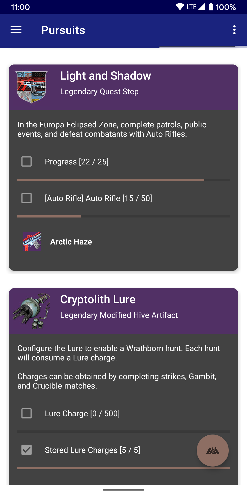
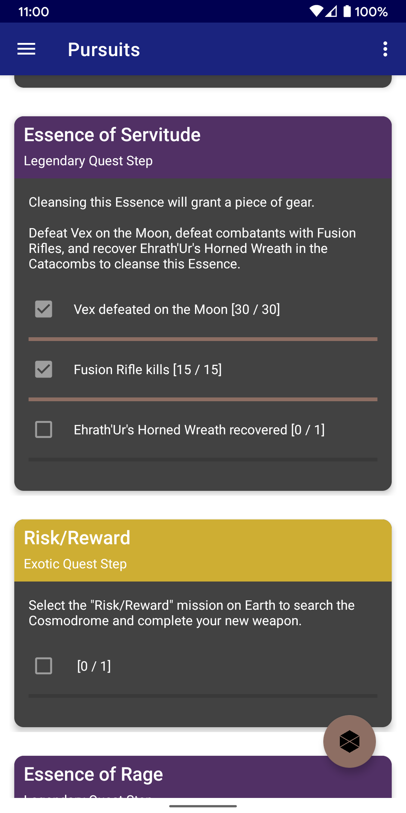

# Destiny Objective Tracker (Android)

This repository contains the source code for the Android version of _Destiny Objective Tracker_ (or "DOT" for short), which is an application that is designed to help Guardians keep track of various in-game objectives.

Please feel free to open an issue if you have a feature request, find any bugs, or just have any feedback for me in general. 

Currently, DOT for Android is in alpha as I work to bring the application to a level of stability and quality that anyone would expect from an application on the Play Store. 

However, if you'd like an early look at DOT, feel free to build the app from source (using this repository), or optionally, you can join the [Alpha program](https://dot.omnicron.xyz/android_alpha.html). A word of warning however, you might see some instability / rough edges while the app is in alpha. 

Once stability improves, DOT will be available as an open beta on the Play Store, and then will hit general availability.

